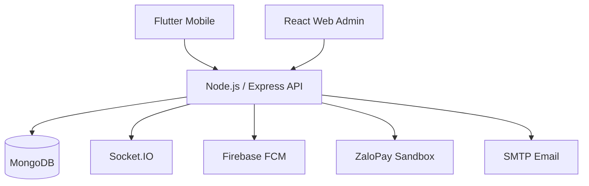

# Sport Energy - Sports Complex Management System

Hệ thống quản lý khu liên hợp thể thao, hỗ trợ đặt sân, lịch cố định, thanh toán, ghép trận và vận hành cơ sở thể thao. Dự án gồm ứng dụng Flutter Mobile, Web Admin React và Backend Node.js/Express.

## Chức năng chính

- Quản lý tài khoản và phân quyền `CUSTOMER`, `STAFF`, `ADMIN`.
- Đăng ký, xác thực email bằng OTP, đăng nhập JWT, làm mới token và đặt lại mật khẩu.
- Quản lý cơ sở thể thao, môn thể thao, sân, khung giờ và thời gian bảo trì.
- Đặt sân, kiểm tra trùng lịch, tính giá, duyệt/hủy booking và quản lý lịch sử.
- Lịch cố định theo ngày/tuần, duyệt bởi STAFF/ADMIN và tự sinh booking.
- Ghép trận thủ công và ghép trận tự động qua hàng đợi.
- Thanh toán tiền mặt và ZaloPay Sandbox.
- Thông báo thời gian thực qua Socket.IO, thông báo đẩy qua Firebase Cloud Messaging.
- Báo cáo doanh thu, hiệu suất sân và giám sát vận hành.

## Vai trò và nền tảng

| Vai trò | Mobile Flutter | Web Admin React | Quyền chính |
| --- | --- | --- | --- |
| `CUSTOMER` | Yes | No | Đặt sân, thanh toán, lịch cố định, ghép trận, thông báo, hồ sơ |
| `STAFF` | Yes | Yes | Xử lý booking, thu ngân, quản lý sân/slot, duyệt lịch cố định, báo cáo cơ sở |
| `ADMIN` | Yes | Yes | Quản lý toàn hệ thống, người dùng, cơ sở, sân, báo cáo nâng cao |

## Kiến trúc



## Công nghệ

| Thành phần | Công nghệ |
| --- | --- |
| Mobile | Flutter, Dart, BLoC, get_it, go_router, Dio |
| Web Admin | React, TypeScript, Ant Design, TanStack Query, Recharts |
| Backend | Node.js, Express, JWT, bcrypt, Nodemailer, node-cron |
| Database | MongoDB, Mongoose |
| Realtime | Socket.IO, Firebase Cloud Messaging |
| Dịch vụ ngoài | Cloudinary, ZaloPay Sandbox |

## Nghiệp vụ nổi bật

### Đặt sân

1. Khách hàng chọn cơ sở, môn thể thao, sân, ngày và khung giờ.
2. Backend kiểm tra trạng thái sân, thời gian bảo trì và xung đột booking.
3. Hệ thống tính giá, tạo booking và hóa đơn ở trạng thái chờ xử lý.
4. STAFF/ADMIN xử lý booking hoặc thanh toán trực tuyến cập nhật trạng thái giao dịch.

### Ghép trận tự động

Người dùng có thể vào hàng đợi với các tiêu chí về môn thể thao, cơ sở, thời gian, số lượng thành viên và chế độ đội. Cron matchmaker định kỳ tìm các yêu cầu tương thích, tạo booking và `MatchingSession` khi đủ điều kiện, sau đó gửi thông báo cho các thành viên liên quan.

### Lịch cố định

Khách hàng tạo lịch theo ngày hoặc tuần. STAFF/ADMIN phê duyệt lịch; hệ thống tự động sinh các booking trong phạm vi áp dụng, đồng thời hỗ trợ tạm dừng, tiếp tục và hủy một buổi cụ thể.

## Cấu trúc dự án

```text
.
├── node_be_refactor/       # Backend Node.js / Express
├── sport_management/       # Flutter Mobile application
└── web-admin/              # React Web Admin application
```

> Tên thư mục Web Admin có thể khác tùy phiên bản source hiện tại.

## Chạy Backend

```bash
cd node_be_refactor
npm install
npm run dev
```

Backend mặc định chạy tại `http://localhost:3000`.

### Biến môi trường Backend

Tạo file `.env` và cấu hình các biến sau, không đưa giá trị bí mật lên Git:

```env
PORT=3000
MONGODB_URI=
JWT_SECRET=
JWT_REFRESH_SECRET=
JWT_EXPIRES_IN=15m
JWT_REFRESH_EXPIRES_IN=7d

EMAIL_USER=
EMAIL_PASS=

CLOUDINARY_CLOUD_NAME=
CLOUDINARY_API_KEY=
CLOUDINARY_API_SECRET=

ZALOPAY_APP_ID=
ZALOPAY_KEY1=
ZALOPAY_KEY2=
ZALOPAY_CALLBACK_URL=

FIREBASE_PROJECT_ID=
FIREBASE_CLIENT_EMAIL=
FIREBASE_PRIVATE_KEY=
FRONTEND_URL=
NODE_ENV=development
```

## Chạy Flutter Mobile

```bash
cd sport_management
flutter pub get
flutter run
```

Cập nhật API base URL trong cấu hình mạng của ứng dụng trước khi chạy trên thiết bị thật hoặc emulator.

## Chạy Web Admin

```bash
cd web-admin
npm install
npm start
```

Ví dụ file `.env` cho Web Admin:

```env
REACT_APP_API_BASE_URL=http://localhost:3000/api/v1
REACT_APP_SOCKET_URL=http://localhost:3000
```

## API tiêu biểu

| Nhóm | Endpoint tiêu biểu |
| --- | --- |
| Auth | `POST /api/v1/auth/register`, `POST /api/v1/auth/verify-email`, `POST /api/v1/auth/sign-in` |
| Booking | `POST /api/v1/booking`, `PUT /api/v1/booking/:id/cancel` |
| Fixed schedule | `POST /api/v1/fixed-schedule`, `PUT /api/v1/fixed-schedule/:id/approve` |
| Matching | `POST /api/v1/matching`, `POST /api/v1/matching/queue/join` |
| Payment | `GET /api/v1/payment`, `POST /api/v1/zalopay/create-order` |
| Reports | `GET /api/v1/reports/court-performance`, `GET /api/v1/reports/advanced-performance` |

## Trạng thái và giới hạn hiện tại

- ZaloPay đang sử dụng môi trường Sandbox, chưa phải tích hợp production.
- Hoàn tiền tự động chưa được hiện thực hoàn chỉnh.
- Firebase được sử dụng cho FCM; xác thực email do Backend và SMTP OTP quản lý.
- Chưa có cổng Web dành cho CUSTOMER.
- Khi triển khai nhiều backend instance, cần bổ sung Redis adapter cho Socket.IO và job queue cho cron jobs.

## Bảo mật

- Mật khẩu được băm bằng bcrypt.
- API bảo vệ bằng JWT và phân quyền theo vai trò.
- OTP xác thực email có thời hạn và giới hạn số lần thử.
- Callback ZaloPay được xác thực chữ ký HMAC.
- Không commit `.env`, Firebase service account hoặc khóa ký ứng dụng vào repository.

## Tài liệu

Tài liệu nghiệp vụ, API, ERD, kiểm thử và triển khai được lưu trong thư mục báo cáo của dự án.
